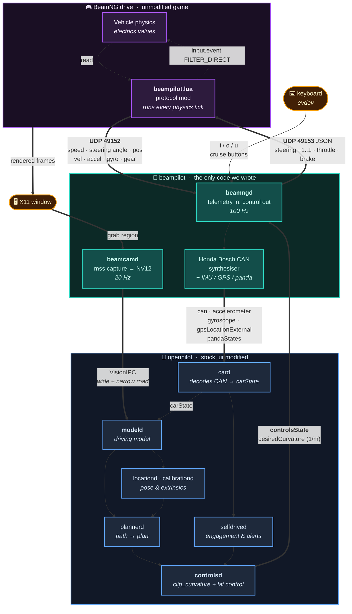
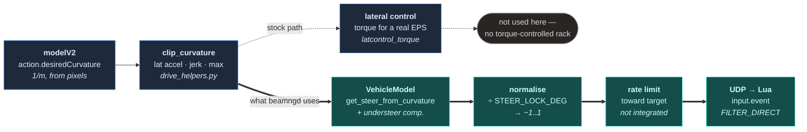

<div align="center">

# beampilot-drive

**openpilot, driving a car in BeamNG.drive**

[](LICENSE)
[](#requirements)
[](https://www.beamng.com/game/)
[](#why-no-beamngtech)
[](https://github.com/commaai/openpilot)

</div>

---

A fork of [openpilot](https://github.com/commaai/openpilot) that swaps the camera and CAN bus for
a screen capture of BeamNG.drive and a small Lua mod. The driving stack is untouched — the same
`modeld`, `controlsd`, `plannerd` and `locationd` that run on comma hardware run here, and they
have no idea they're looking at a video game.

It works with the normal Steam version. No BeamNG.tech, no `beamngpy`.

**It steers, holds a set speed, brakes for traffic, and changes lanes when you signal.** It is
also not polished: the steering geometry is calibrated for a Honda Civic rather than whatever car
you spawn, there's no real wide-angle camera, and it will drive into things if you let it.

## Contents

- [Requirements](#requirements)
- [Install](#install)
- [Running it](#running-it)
- [Configuration](#configuration)
  - [Camera capture](#camera-capture) · [Wayland](#wayland)
- [How it works](#how-it-works)
- [Knowledge base](#knowledge-base) — the non-obvious parts, in detail
- [Troubleshooting](#troubleshooting)
- [Known problems](#known-problems)
- [Differences from ko6lvm/beampilot](#differences-from-ko6lvmbeampilot)
- [Development](#development)

---

## Requirements

| | |
|---|---|
| **OS** | Linux. openpilot is Linux-only; BeamNG.drive ships a native Linux build, so no Proton. |
| **GPU** | Anything [tinygrad](https://tinygrad.org) supports (NVIDIA or AMD). It renders the game *and* runs the driving model simultaneously. |
| **VRAM** | 4 GB standard model, 8 GB for chestnut-class. |
| **RAM** | 16 GB standard, 32 GB chestnut. |
| **Groups** | Your user needs to be in `input` (keyboard reads, and `/dev/uinput` for joystick mode). |
| **Display** | X11. Wayland works via XWayland in most cases — see [Wayland](#wayland). |
| **Optional** | `xdotool`, for capturing the BeamNG window rather than a whole monitor. |

> [!NOTE]
> These are conservative rather than measured floors. The GPU is the real constraint: it's
> shared between rendering and inference, and a weaker card shows up as dropped camera frames
> before anything else breaks.

## Install

```bash
git clone --recurse-submodules https://github.com/Caleb-J773/beampilot-drive.git
cd beampilot-drive
uv run python tools/beampilot_setup.py
```

The setup tool checks your system before touching anything and tells you what's missing and how
to fix it. It's read-only until you confirm, and it offers to install the mod and run the build
for you.

<details>
<summary>What it checks</summary>

| | |
|---|---|
| **OS and Python** | Linux, and whether Python 3.12 is available (uv fetches it otherwise). |
| **GPU** | Detected via `nvidia-smi` and `lspci`, with the right `USE_NV`/`USE_AMD` to set. |
| **Display server** | X11 vs Wayland, whether capture will work, and whether `xdotool` is present. |
| **Permissions** | `input` group membership, with the `usermod` line if you're missing it. |
| **BeamNG** | Finds the game and your userfolder by parsing Steam's `libraryfolders.vdf`, so installs on secondary drives and flatpak Steam are found rather than guessed at. |
| **Capture target** | Lists the BeamNG windows it can see, so you can confirm it will grab the right one. |

</details>

If you'd rather do it by hand, `./setup_beampilot.sh` still does the build and mod symlink on its
own.

> [!IMPORTANT]
> Launch BeamNG.drive at least once **before** running setup, so the userfolder exists. If you
> install the game later, just run setup again.

### Configuring

There's a terminal UI if you'd rather not edit shell variables by hand:

```bash
uv run python tools/beampilot_tui.py
```

<details>
<summary>What the TUI does</summary>

Groups every setting under Hardware / Car / Driving limits / Controls / Camera / Alerts, with an
explanation of what each one does and what the stock openpilot value is. Detects your GPUs via
`nvidia-smi` and `lspci` and only offers backends this machine has. Settings that differ from
their default are highlighted; ones with consequences (like `BEAMPILOT_IGNORE_COMM_ISSUE`) warn.

`r` runs setup, `L` launches, `m` opens the monitor, `s` saves, `q` quits.

`config_beampilot.sh` remains the source of truth. The TUI rewrites only the `export` lines it
manages and preserves everything around them, including trailing inline comments. Editing the
file by hand works fine and round-trips correctly.

</details>

## Running it

Start BeamNG, spawn a car, then:

```bash
source .venv/bin/activate.fish   # bash/zsh: source .venv/bin/activate
./launch_beampilot.sh
```

Startup takes a while, which is plenty of time to tab back into the game. Once it's up, get above
~20 mph and press `i`. (Set `BEAMPILOT_LAUNCH_DELAY=5` if you'd rather have a countdown first.)

<div align="center">

| Key | Action |
|:---:|---|
| <kbd>i</kbd> | Set speed and engage (nudges speed down if already engaged) |
| <kbd>o</kbd> | Resume / speed up |
| <kbd>u</kbd> | Cancel |
| <kbd>,</kbd> <kbd>.</kbd> | Turn signals — signal while engaged to change lanes |

</div>

> [!TIP]
> Keys are read straight from the keyboard device via `evdev`, because BeamNG holds window focus
> while you drive. They're `i`/`o`/`u` rather than something memorable because the obvious keys
> are already taken by BeamNG (<kbd>c</kbd> cycles the camera). Rebind them with
> `BEAMPILOT_KEY_SET` / `_RESUME` / `_CANCEL`, but check
> `settings/inputmaps/keyboard.json` in the BeamNG install first — a key bound on both sides
> does both things.

### Watching what it's doing

```bash
uv run python tools/beampilot_monitor.py
```

Live message rates for every channel, what openpilot believes the car is doing, what it's
commanding, what the model predicts, and whether the turn limits are actually binding. This is
the first thing to run when something looks wrong.

`tools/beampilot_diag.py` is a one-shot version that also checks the raw UDP link from the mod.

## Configuration

Everything lives in `config_beampilot.sh`. **Every beampilot setting falls back to the stock
openpilot value when unset**, so deleting a line gives you unmodified behaviour rather than a
crash.

### Hardware

| Setting | Default | |
|---|---|---|
| `USE_NV` / `USE_AMD` | `USE_NV=1` | GPU backend. Set exactly one. |
| `CHESTNUT` | `0` | Larger model. Needs 8 GB VRAM. |
| `BIG` | `1` | Window resolution: `1` = 2160×1080 (comma 3/3X), `0` = 536×240 (comma 4). Not a scale knob. |
| `SCALE` | unset | Multiplies the above. `0.6` ≈ 1296×648. |

### Driving limits

Stock openpilot follows EU/ISO passenger-comfort guidelines. In a simulator those are usually
the reason it won't take a corner.

| Setting | Stock | |
|---|---|---|
| `BEAMPILOT_MAX_LAT_ACCEL` | `3.0` m/s² | Turning. Max curvature is `accel / v²` — stock allows only a ~300 m radius at 67 mph. |
| `BEAMPILOT_MAX_LAT_JERK` | `5.0` m/s³ | How fast curvature may change. **The usual cause of weaving if raised too far.** |
| `BEAMPILOT_MAX_CURVATURE` | `0.2` 1/m | Geometric cap. Only binds below ~11 mph. |
| `BEAMPILOT_ACCEL_SCALE` | `1.0` | Multiplier on the acceleration envelope. |
| `BEAMPILOT_DECEL_SCALE` | `1.0` | Same, braking. |
| `BEAMPILOT_PERSONALITY` | `1` | Follow distance: `0` aggressive (1.25 s), `1` standard (1.45 s), `2` relaxed (1.75 s). |

<details>
<summary>What raising these actually does (and doesn't)</summary>

These are *permission* limits. `clip_curvature()` in `drive_helpers.py` clamps the model's
requested curvature before it reaches the lateral controller — raising the ceiling stops the
clipping, it doesn't make the model want to turn harder.

The effect of the shipped values, in turn radius:

| Speed | Stock (3.0) | Configured (5.0) |
|---|---|---|
| 30 mph | 60 m | 36 m |
| 50 mph | 166 m | 100 m |
| 67 mph | 299 m | 179 m |

Whether this matters depends on whether the limit is *binding*. The monitor prints
`BINDING — raising the limit helps` or `not binding — limit is NOT the constraint` so you can
tell rather than guess. If it's not binding and the car still runs wide, the cause is the
[steering geometry mismatch](#steering-geometry-mismatch), not the limit.

</details>

### Vehicle

| Setting | Default | |
|---|---|---|
| `BEAMPILOT_STEER_LOCK_DEG` | `510` | Your BeamNG car's steering lock. **Per-vehicle.** |
| `BEAMPILOT_STEER_SWEEP_SECONDS` | `0.15` | Lock-to-lock sweep time. Lower is snappier and twitchier. |
| `FINGERPRINT` | `HONDA_CIVIC_2022` | The car openpilot thinks it's driving. |

> [!WARNING]
> Changing `FINGERPRINT` breaks `beamngd`, which hand-packs Honda Bosch CAN messages
> (`ENGINE_DATA`, `WHEEL_SPEEDS`, `POWERTRAIN_DATA`, `ACC_HUD`…) against
> `honda_bosch_radarless_generated.dbc`. Another car needs all of that rewritten against its own
> DBC, plus rework of the cruise-engagement path.

To find your steering lock: hold full lock in-game and read `steering_wheel_deg` in the monitor.
Too low makes openpilot oversteer, too high makes it run wide.

### Controls and alerts

| Setting | Default | |
|---|---|---|
| `BEAMPILOT_KEY_SET` / `_RESUME` / `_CANCEL` | `i` / `o` / `u` | Cruise keys, single letters. |
| `BEAMPILOT_CRUISE_STEP_MPH` | `1.0` | Per-tap speed change. |
| `BEAMPILOT_AUTO_LANE_CHANGE` | `1` | Signal alone commits a lane change. Required here. |
| `BEAMPILOT_CONTROL_MODE` | `lua` | `lua` or `joystick`. |
| `BEAMPILOT_CAM_WINDOW` | `beamng` | Track the game window by name/class. See [Camera capture](#camera-capture). |
| `BEAMPILOT_CAM_MONITOR` | `1` | Whole-monitor fallback. |
| `BEAMPILOT_CAM_REGION` | unset | `left,top,width,height`, a fixed rectangle. |
| `BEAMPILOT_IGNORE_COMM_ISSUE` | `0` | See warning below. |
| `BLOCK` | `,soundd` | Processes not to start. `soundd` mutes alert chimes. |

> [!CAUTION]
> `BEAMPILOT_IGNORE_COMM_ISSUE` is **behavioural, not cosmetic**. Unlike the alerts suppressed
> under `SIMULATION`, this one changes what openpilot *does*: `commIssue` is registered as both
> `NO_ENTRY` and `SOFT_DISABLE`, so suppressing it means openpilot keeps steering on stale model
> output if `modeld` stalls or dies, instead of handing back control. The event is still logged.

### Vehicles

Tested and working to some degree:

| Vehicle | Notes |
|---|---|
| **ETK series** (800, I, K) | Best results. The camera framing was tuned against these, and the hood sits where the model expects it. |
| **Bastion** | Works. |
| **SBR4** | Works. |
| **Sunburst** | Works. |

> [!NOTE]
> **Outside the ETK series the framing is off.** Other cars show less of the hood and the view is
> clipped slightly, because `openpilot_cam`'s offsets are fixed rather than per-vehicle. It still
> drives, but the model has less of the visual context it was trained on. If a car behaves badly,
> that framing is the first thing to suspect — nudge `offUp`/`offFwd` in
> `tools/beamng_mod/openpilot_cam/lua/ge/extensions/core/cameraModes/openpilot.lua`.

Each vehicle also has its own steering lock, so set `BEAMPILOT_STEER_LOCK_DEG` when you switch
cars (hold full lock and read `steering_wheel_deg` in the monitor).

<details>
<summary><b>Using BeamNG's dashboard camera instead</b></summary>

The stock dashboard view can work as a capture source, but it's a downgrade:

- **Heavy motion blur.** You'll almost certainly want to turn it off in BeamNG's graphics
  settings — the driving model was trained on sharp frames, and blur during exactly the moments
  that matter (turning, braking) is the worst possible time to lose detail.
- **It generally performs worse** than `openpilot_cam`. That camera exists because openpilot's
  model assumes a rigidly-mounted lens with fixed intrinsics; every comfort feature of a normal
  in-game camera — head bob, look-ahead yaw, horizon stabilisation, FOV smoothing — violates
  that assumption. `openpilot_cam` deliberately has none of them and matches openpilot's
  road-camera vertical FOV of 25.70°.

If you do use it, note that `beampilot.lua` auto-selects `openpilot` at spawn, so you'd have to
remove that call or switch cameras manually after it runs.

</details>

### Camera capture

`beamcamd` picks a capture region in this order:

1. **`BEAMPILOT_CAM_REGION`** — a fixed `left,top,width,height` rectangle. Overrides everything.
2. **`BEAMPILOT_CAM_WINDOW`** — track the BeamNG window. It follows the window as you move or
   resize it (re-checked every 2 seconds), so the game can be windowed and you keep another
   monitor free for the openpilot UI and the monitor tool. Needs X11 and `xdotool`.
3. **`BEAMPILOT_CAM_MONITOR`** — grab a whole monitor. The fallback when no window is found.

Window tracking never hard-fails: if the game isn't running or `xdotool` is missing, it says so
and falls back to monitor capture.

<details>
<summary>Why finding the window is harder than it looks</summary>

Three strategies, in order, because none is reliable alone:

**By process.** The honest approach — find BeamNG's PID, ask X which windows it owns. Except
BeamNG runs inside Steam's pressure-vessel container, so the PID in `_NET_WM_PID` frequently
doesn't match what `pgrep` sees. On the development machine this returns nothing at all.

**By `WM_CLASS`.** Stable across window titles and locales, so it's tried before titles.

**By title, filtered.** The fallback, and the one that needs care. A bare search for `beamng`
matched two `gnome-terminal` windows during testing — terminal tabs named after the project
directory. Capturing a terminal instead of the game is a genuinely confusing thing to debug, so
title matches are rejected if the window class looks like a terminal, editor, browser or chat
app, or if the window is smaller than 640×480.

`tools/beampilot_setup.py` prints every candidate it finds, with the strategy that found it, so
you can confirm it's about to grab the right thing.

</details>

### Wayland

BeamNG.drive is an X11 client, so on a Wayland session it runs through XWayland, and capture
usually works. "Usually" is doing real work in that sentence: whether an XWayland window's pixels
are readable depends on your compositor.

> [!WARNING]
> Capturing **native Wayland** surfaces needs the `xdg-desktop-portal` ScreenCast API and a
> PipeWire stream. **That is not implemented here.** If your frames come out black, log into an
> X11/Xorg session.

`tools/beampilot_setup.py` detects your session type and tells you which case you're in rather
than leaving you to work it out from a black screen.

## How it works



**Reading it:** thick arrows are the two closed loops — vision going one way, control coming
back. `beamcamd` grabs the game window and publishes it as camera frames. `modeld` predicts a
path. `plannerd` and `controlsd` turn that into a desired curvature. `beamngd` converts curvature
into a steering angle using opendbc's vehicle model, scales it to BeamNG's `−1‥1` input range,
and sends it over UDP. The Lua mod applies it with `input.event()` — the same function BeamNG's
own AI driver uses.

CAN only flows one direction. `beamngd` fabricates Honda Civic CAN frames from BeamNG telemetry
so openpilot believes it's plugged into a real car. Nothing is ever sent back to the game over
CAN — the return path is that JSON packet on 49153.

<details>
<summary><b>What happens to a single steering command, end to end</b></summary>



Two details worth knowing:

`clip_curvature` **clips** — openpilot does not command past its limit and merely warn. If the
model wants a tighter turn than the lateral-accel budget allows, the excess is discarded and the
car runs wide. That's why raising `BEAMPILOT_MAX_LAT_ACCEL` changes behaviour, and why the
monitor's BINDING line matters.

The rate limiter chases a **target position**, it does not integrate a velocity. An earlier
version did the latter (`position += torque × gain × dt`), which has no equilibrium: any
sustained torque marches to full lock forever. Stacked on openpilot's own PID — which already
integrates error — that's two integrators in series and a textbook growing oscillation.

</details>

<details>
<summary><b>Where every message comes from</b></summary>

| Message | Rate | Published by | Built from |
|---|---|---|---|
| `can` | 100 Hz | `beamngd` | BeamNG telemetry → Honda Bosch frames |
| `accelerometer` / `gyroscope` | 100 Hz | `beamngd` | `sensors.ffiSensors`, angular velocity |
| `gpsLocationExternal` | 10 Hz | `beamngd` | world position, projected to fake lat/lon |
| `pandaStates` | 10 Hz | `beamngd` | mirrors real `carParams.safetyConfigs` |
| `wideRoadCameraState` / `narrowRoadCameraState` | 20 Hz | `beamcamd` | the same captured frame (see [wide camera](#no-wide-angle-camera)) |
| `driverStateV2` / `driverMonitoringState` | ~20 Hz | `beamngd` | faked — driver monitoring is removed |
| `carState` | 100 Hz | `card` *(stock)* | decodes our fake CAN |
| `modelV2` | 20 Hz | `modeld` *(stock)* | the captured frames |
| `controlsState` | 100 Hz | `controlsd` *(stock)* | the plan |

</details>

### Why no BeamNG.tech

BeamNG runs any `.lua` file dropped into a mod's `lua/vehicle/protocols/` folder on every
physics tick — the mechanism behind the stock OutGauge and MotionSim protocols. That gives
direct access to `electrics.values.*` for telemetry and `input.event()` for control, with no
in-game binding and no fake OS input device. `beamngpy` (and therefore the paid research
licence) is only needed for things this doesn't do.

<details>
<summary>The virtual joystick alternative</summary>

`BEAMPILOT_CONTROL_MODE=joystick` creates a `uinput` virtual wheel ("BeamPilot Virtual Wheel")
and drives its axes instead of talking to the mod's control socket. BeamNG reads it like any
USB wheel, which means a one-time bind of Steering/Accelerate/Brake in Options → Controls.

It exists mostly because [jackz314's ETS2/ATS bridge](https://github.com/jackz314/openpilot/tree/master/tools/truck_sim)
has to work that way — ETS2 has no scripting hook at all. BeamNG does, so Lua injection is the
default and the more direct path. Requires `input` group membership for `/dev/uinput`.

</details>

---

## Knowledge base

The parts that took the longest to work out, written down so they don't have to be rediscovered.
`CLAUDE.md` has more.

<details>
<summary><b>The steering chain, step by step</b></summary>

1. `modeld` publishes `modelV2.action.desiredCurvature` — where it wants to go, in 1/m.
2. `controlsd` runs it through `clip_curvature()`, which enforces the lateral accel, jerk and
   max-curvature limits. **This clips the value** — openpilot does not command past its limit
   and merely warn.
3. The clipped curvature goes to the lateral controller, which produces `actuators.torque`.
4. `beamngd.send_control()` takes `controlsState.desiredCurvature` and calls
   `VehicleModel.get_steer_from_curvature(curvature, speed, 0.0)`. This is opendbc's own inverse
   of `calc_curvature()` and includes the speed-dependent understeer compensation
   (`curvature_factor`) that a flat `angle = curvature × wheelbase × steerRatio` formula misses.
   Real tyres need *more* wheel angle for the same curvature the faster you go, which is why a
   single fixed gain works at one speed and not another.
5. Radians → degrees → divided by `BEAMPILOT_STEER_LOCK_DEG` → normalised to −1…1.
6. Rate-limited toward that target (not integrated as a velocity — see below), then sent as JSON
   over UDP.
7. The Lua mod calls `input.event("steering", v, FILTER_DIRECT)`.

**Why rate-limit toward a target instead of integrating.** An earlier version treated torque as
a *velocity* (`position += torque × gain × dt`). That has no equilibrium: any sustained non-zero
torque marches the position to full lock forever, because nothing pulls it back. Stacked on
openpilot's own PID — which already integrates error into torque — that's two integrators in
series, a textbook growing oscillation. Treating the command as a *target position* and
rate-limiting the approach gives a bounded equilibrium.

</details>

<details>
<summary><b>Two independent steering limits, and why only one counts</b></summary>

`_check_saturation()` in `latcontrol.py`:

```python
if (saturated or curvature_limited) and CS.vEgo > self.sat_check_min_speed \
   and not steer_limited_by_safety and not CS.steeringPressed:
```

1. **Planning/comfort limit** — `clip_curvature`, the EU/ISO lateral accel cap. This is what
   `BEAMPILOT_MAX_LAT_ACCEL` raises. It *does* count toward the saturation warning.
2. **Safety/actuation limit** — `steer_limited_by_safety`, the car's torque and rate limits in
   `carcontroller.py` plus panda safety. This explicitly does **not** count, because that's the
   car's firmware refusing, not openpilot being conservative. Untouched here, and it should stay
   that way — it's the layer that stops a software bug yanking the wheel.

</details>

<details>
<summary><b>Message rates matter more than they look</b></summary>

`commIssue` is `NO_ENTRY` + `SOFT_DISABLE` — wrong publish rates block engagement *and*
disengage mid-drive. They are not cosmetic log spam.

`SimulatedSensors` emits multi-sample bursts (5× IMU, 10× GPS) sized for a ~20 Hz caller.
`beamngd` ticks at 100 Hz. Measured before this was fixed:

| Channel | Was | Expected | Now |
|---|---|---|---|
| `gpsLocationExternal` | **1000 Hz** | 10 Hz | 9.4 Hz |
| `accelerometer` / `gyroscope` | 500 Hz | 104 Hz | 100 Hz |
| `pandaStates` | 2 Hz | 10 Hz | 10 Hz |
| `can` | 100 Hz | 100 Hz | 100 Hz |

The 100× GPS overshoot was real CPU load — a thousand capnp messages a second — and it starved
the fixed-size (512 checkpoint) EKF rewind buffer `locationd` needs for the backdated
`cameraOdometry` observations.

</details>

<details>
<summary><b>Engagement: the pcmCruise deadlock</b></summary>

`HONDA_CIVIC_2022` without alpha-long has `pcmCruise=True`. opendbc's Honda `carstate.py` sets
`cruiseState.enabled` straight from the `ACC_STATUS` CAN signal, and openpilot only engages
*after* seeing that go true — it expects the car's own ACC to switch on by itself, like a real
Honda's cruise button does.

So `ACC_STATUS` has to be driven directly from the cruise button (`self.acc_engaged` in
`beamngd`), never from `selfdriveState.active`. Sourcing it from `active` is circular: nothing
is ever first to flip `cruiseState.enabled`, and openpilot can never engage no matter how many
times you press the button.

Separately, `AlphaLongitudinalEnabled` must be set *before* the stack starts, or
`openpilotLongitudinalControl` stays false and openpilot steers while waiting for an ACC that
doesn't exist.

</details>

<details>
<summary><b>Bosch vs non-Bosch cruise speed</b></summary>

This car is Bosch, which takes a completely different branch in `carstate.py`:

```python
if self.CP.flags & HondaFlags.BOSCH:
    acc_hud = cp_cam.vl["ACC_HUD"] if BOSCH_RADARLESS else cp.vl["ACC_HUD"]
    ret.cruiseState.speed = ... acc_hud["CRUISE_SPEED"] ...
else:
    ret.cruiseState.speed = cp.vl["CRUISE"]["CRUISE_SPEED_PCM"] * CV.KPH_TO_MS
```

The set speed comes from `ACC_HUD.CRUISE_SPEED` **on the camera bus**. `CRUISE_SPEED_PCM` is
only read for non-Bosch Hondas — populating it does nothing here.

</details>

<details>
<summary><b>Don't echo openpilot's own pedal back at it</b></summary>

`electrics.values.throttle` reports the vehicle's current pedal state. While engaged, that *is*
openpilot's own `input.event` command coming back around. Reporting it as the driver's pedal
sets `CS.gasPressed`, which trips the rising-edge `pedalPressed` check in `selfdrived.py` and
disengages the instant openpilot tries to accelerate.

While engaged there's no separate user pedal input to report anyway — `pollControl()` calls
`input.event(FILTER_DIRECT)` every tick, overwriting whatever the player's keys set.

</details>

<details>
<summary><b>Camera timestamps</b></summary>

Frames must carry `time.monotonic_ns()`, not a synthetic `frame_id × dt` counter.
`locationd._validate_timestamp` compares camera time against the Kalman filter's elapsed time
and rejects fake values on every single frame, forever, silently blocking
`deviceMotion.inputsOK`.

This same bug exists unfixed in openpilot's own `system/camerad/webcam/camerad.py` — it just
never runs there, since that driver is disabled.

</details>

<details>
<summary><b>Lua gotchas</b></summary>

- **Declare locals above every function that references them.** Otherwise Lua silently creates
  an implicit global instead of closing over the variable, and state resets mysteriously.
- **`releaseControl()` must only fire on the disengage edge.** `beamngd` sends a control packet
  every tick regardless of engagement, so "not engaged" is the constant common case. Zeroing
  `input.event` every not-engaged tick fights — and beats — the player's own WASD input.
- **Bind the control socket lazily.** `init()` runs once per spawned vehicle, including traffic
  AI, so binding there makes every car in the scene race for the same port. Bind from
  `pollControl()`, which only the player-seated vehicle reaches.

</details>

---

## Troubleshooting

| Symptom | Likely cause | Fix |
|---|---|---|
| Won't engage at all | Below 20 mph, or `cruiseState.enabled` never went true | Check `carState` in the monitor |
| Engages then immediately disengages | `gasPressed` / `brakePressed` stuck true, or `commIssue` | Monitor → check the alert text |
| Steers but runs wide on corners | Steering lock wrong, or limits binding | Set `BEAMPILOT_STEER_LOCK_DEG`; check the BINDING line |
| Weaving / oscillation | `BEAMPILOT_MAX_LAT_JERK` too high | Lower it toward 5.0 first |
| Doesn't accelerate | `openpilotLongitudinalControl` false | Confirm `AlphaLongitudinalEnabled` was set at launch |
| Brakes too early for traffic | Follow distance | `BEAMPILOT_PERSONALITY=0` |
| Lane change arms but never commits | Needs the steering nudge | `BEAMPILOT_AUTO_LANE_CHANGE=1` |
| Bursts of `observation too old` | `modeld` behind, GPU contention | Lower BeamNG's graphics settings |
| `Address already in use` on 49152 | A previous `beamngd` still running | `pkill -f beamngd.py` |
| Nothing publishing at all | Stack not running | `tools/beampilot_diag.py` |
| Camera frames are black | Wayland compositor blocking capture | Use an X11 session — see [Wayland](#wayland) |
| It's capturing the wrong window | Ambiguous title match | Run `tools/beampilot_setup.py` to list candidates; pin it with `BEAMPILOT_CAM_REGION` |
| Model sees nothing / drives blind | Capturing the wrong monitor | Set `BEAMPILOT_CAM_WINDOW=beamng`, or fix `BEAMPILOT_CAM_MONITOR` |

> [!TIP]
> Almost every question here is answered by `tools/beampilot_monitor.py`. Rates tell you what's
> alive; the `carState` block tells you what openpilot believes; the BINDING line tells you
> whether a limit is the constraint. Guessing is slower.

## Known problems

### No wide-angle camera

openpilot expects two road cameras: a narrow one and a roughly 120° wide one. `beamcamd` has
only the single game view, so it publishes **the same frame to both streams**. `modeld` computes
`has_wide_camera = use_extra_client or main_wide_camera`, which is `True` here, so it applies
`dc.wide_road.intrinsics` — a wide-lens calibration — to an image that doesn't have that field
of view.

The model therefore misjudges how far objects and lane lines sit laterally. **This is worst in
turns**, where the real wide camera is what sees around the corner.

> [!WARNING]
> **Keep Experimental mode off.** Its end-to-end longitudinal policy leans much harder on
> wide-camera scene understanding and behaves noticeably worse here.

Proper fix: a second BeamNG camera at a genuinely wide FOV published separately to
`VISION_STREAM_WIDE_ROAD`. The existing `openpilot_cam` mod shows how to register a
rigidly-mounted FOV-matched camera; this needs a second one plus a second capture region.

### Steering geometry mismatch

openpilot computes a steering angle from the **Civic's** steer ratio (15.38) and wheelbase
(2.700 m). Your BeamNG car has neither. Only the steering lock has been measured and made
configurable, so commanded curvature and achieved curvature still don't match and the car runs
wide. The real fix is calibrating the mapping against measured yaw rate, which the telemetry
already carries.

### Smaller things

- `carState.vCruise` reports a nonsense set speed while `cruiseState.speed` is correct.
- `beamcamd` drops ~6% of frames.
- Driver-monitoring channels publish at 33 Hz where 20 is expected.

## Safety

> [!CAUTION]
> **Simulation only.** Driver monitoring (`dmonitoringmodeld`/`dmonitoringd`) is removed and
> several safety alerts are suppressed. Disabling driver monitoring in a real vehicle is
> dangerous and violates comma's requirements. Do not put this in a car.

## Differences from [ko6lvm/beampilot](https://github.com/ko6lvm/beampilot)

Ryan's beampilot established the architecture this builds on: the process list, the
`beamngd`/`beamcamd` split, the config and launch scripts, and the plan for a BeamNG bridge.
Both daemons were stubs at that point, marked *"currently inop"* — `beamngd` published zeroed
CAN and `beamcamd` published a black frame.

About **1,650 lines across 22 files**.

<details>
<summary><b>Rewritten or new</b></summary>

- **`beamngd`** — parses live telemetry, synthesises Honda CAN, reads cruise buttons over
  `evdev`, converts desired curvature to BeamNG steering via `VehicleModel`.
- **`beamcamd`** — real capture pipeline (mss + OpenCV NV12). Meets its 20 Hz target; was
  managing 15.3 Hz before optimisation.
- **The BeamNG mods** — `beampilot_bridge` (telemetry and control) is new; `openpilot_cam` (the
  rigid, FOV-matched camera) is now bundled in the repo and installed automatically, rather than
  being a separate thing you had to already have.
- **`abeamngd.py`** — deleted; depended on the unavailable `beamngpy`.
- **Window-tracking capture** — `window_capture.py` finds the game window instead of grabbing a
  whole monitor, and follows it as it moves.
- **Tooling** — `beampilot_setup.py` (guided install and system check), `beampilot_tui.py`
  (config), `beampilot_monitor.py` and `beampilot_diag.py` (diagnostics).

</details>

<details>
<summary><b>Bugs found and fixed</b></summary>

- **`calibrationd` never converged.** It needs minutes of sustained straight highway driving
  before it trusts its extrinsics; until then the model's road frame is wrong, which reads as
  steering bias rather than an error. Now seeded at launch.
- **Message rates were badly off** — GPS at 1000 Hz against an expected 10, IMU at 5×,
  `pandaStates` 5× too slow.
- **Cruise speed always zero** — wrong CAN message for a Bosch car.
- **No longitudinal control at all** — `AlphaLongitudinalEnabled` unset, so `pcmCruise=True`.
- **Throttle feedback loop** — openpilot's own pedal command echoed back as driver input,
  disengaging it the instant it accelerated.
- **Synthetic camera timestamps** — `locationd` rejected every frame.
- **Controls Mismatch** — `pandaStates` hardcoded safety flags instead of mirroring
  `carParams.safetyConfigs`.

</details>

### Process changes vs. stock openpilot

**Removed** (hardware-specific or pointless on a desktop): `camerad`, `webcamerad`, `sensord`,
`pandad`, `_pandad`, `micd`, `dmonitoringmodeld`, `dmonitoringd`, `updated`, `qcomgpsd`,
`ubloxd`, `pigeond`, `modem`

**Added:** `beamngd` (telemetry, fake sensors, control — 100 Hz) and `beamcamd` (camera — 20 Hz)

Everything else is stock.

## Development

`CLAUDE.md` carries the architecture notes and the full gotcha list. Read it before touching
`beamngd`, `beamcamd` or the Lua mod.

Mod edits under `tools/beamng_mod/` apply live — reload with <kbd>Ctrl</kbd>+<kbd>L</kbd> in game.

```bash
uv run ruff check .
```

> [!NOTE]
> Pushes from this fork need `git push --no-verify`. openpilot's inherited `.lfsconfig` points
> LFS at comma's own GitLab over SSH, which nobody else can authenticate to. Nothing here is
> LFS-tracked, so skipping the hook is lossless — the LFS *fetch* URL stays public, so clones
> still pull openpilot's model weights normally.

## Credits

Built on [**openpilot**](https://github.com/commaai/openpilot) by comma.ai.
Forked from [**ko6lvm/beampilot**](https://github.com/ko6lvm/beampilot).
[**jackz314/openpilot**](https://github.com/jackz314/openpilot)'s ETS2 bridge was useful prior art.

MIT, inherited from openpilot. See [LICENSE](LICENSE).
